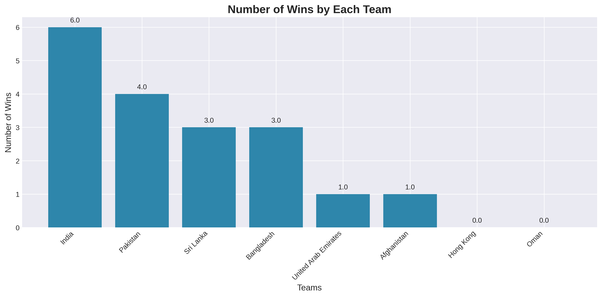
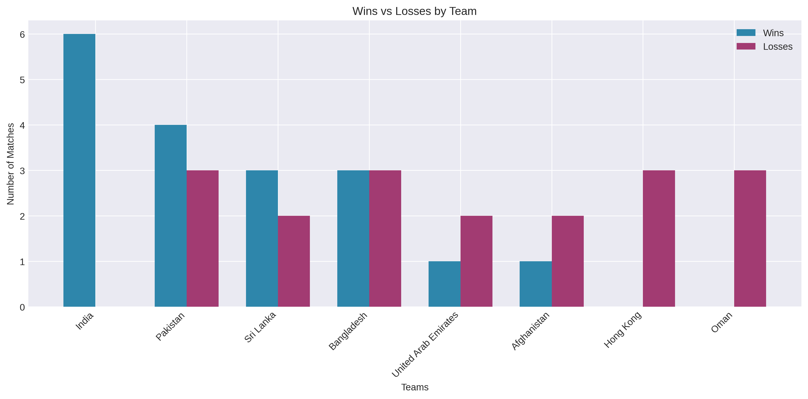
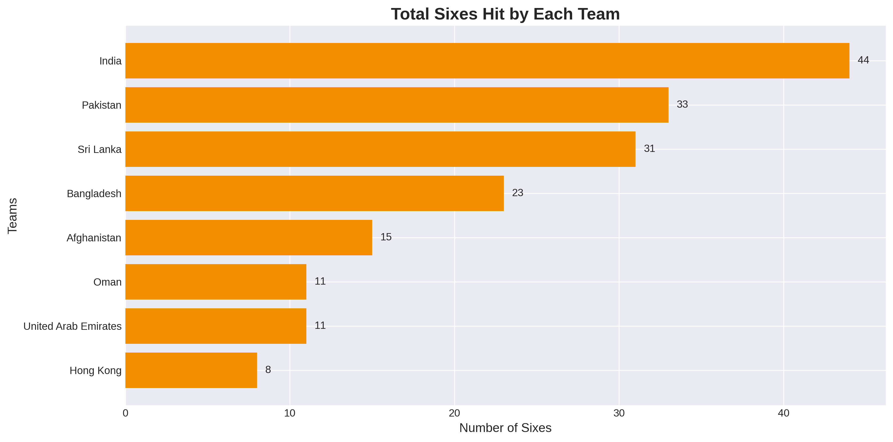
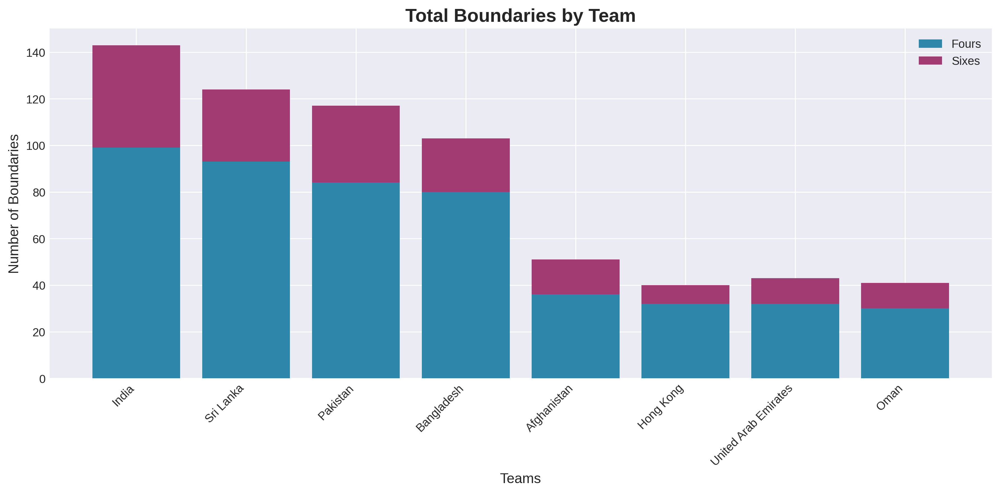
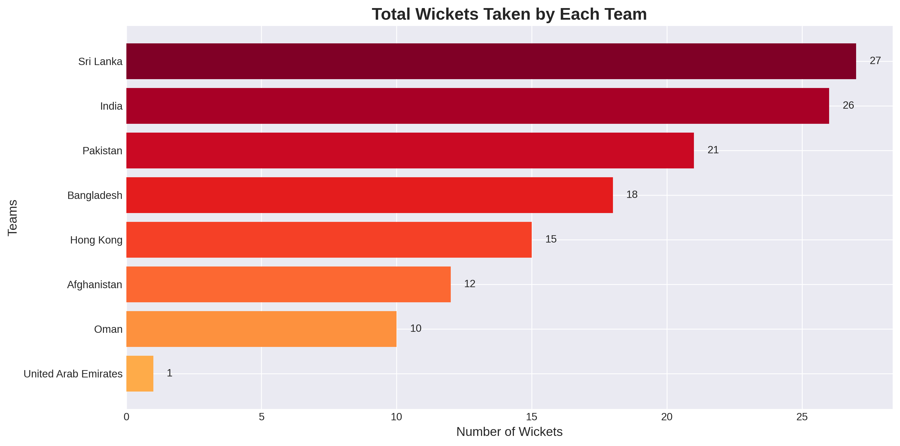
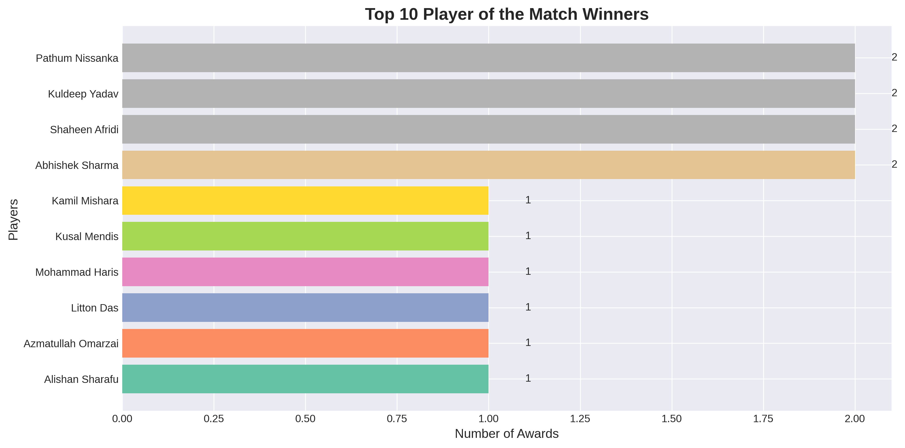

# 🏏 Asia Cup 2025: Comprehensive T20 Dataset & Exploratory Analysis
 
<p align="center">
  <a href="https://kousarraza.github.io/AsiaCup2025"></a>
  <a href="https://arxiv.org/abs/2512.XXXX"></a>
  <a href="https://doi.org/10.5281/zenodo.17228056"></a>
  <a href="https://github.com/kousarraza/AsiaCup2025/blob/main/LICENSE"></a>
  <a href="https://github.com/kousarraza/AsiaCup2025/stargazers"></a>
  <a href="https://github.com/kousarraza/AsiaCup2025/network/members"></a>
  <a href="https://github.com/kousarraza/AsiaCup2025/issues"></a>
</p>

<p align="center">
  <a href="https://github.com/kousarraza">Kousar Raza</a><sup>1*</sup> · 
  <a href="https://github.com/faizanali">Faizan Ali</a><sup>2*</sup>
</p>

<p align="center">
  <sup>1</sup>University of Isfahan, Iran · <sup>2</sup>University of Sindh, Jamshoro, Pakistan
</p>


----

## 📊 Overview
The **Asia Cup 2025 T20 Dataset** provides a **structured dataset and detailed exploratory analysis** of all 19 matches of the tournament. It contains **61 curated variables per match**, enabling in-depth analysis of teams, players, and match dynamics.  

**Why This Dataset?**
- 📈 **Comprehensive Coverage:** All group, Super Four, and Final stage matches  
- 🔍 **Rich Variables:** Player stats, team performance, match outcomes  
- 📊 **Professional Visualizations:** 22 charts including heatmaps, boundaries, wickets, and more  
- 🌐 **Open Access:** Fully open dataset and code for research and analysis

---

## 📋 Dataset Features

### Match Information
- Match number, series, date, time, venue  
- Teams, toss winner, toss decision, match result  
- Tournament stage, Player of the Match, match referee, umpires  

### Team Performance Metrics
- **Batting:** Runs, wickets, overs, extras  
- **Bowling:** Wickets taken, economy rates  
- **Powerplay:** Runs scored in powerplay overs  
- **Boundaries & Sixes:** Team totals per match  
- **Fall of Wickets:** Dismissal sequences  

### Player Statistics
- Top scorer per team  
- Top wicket-taker per team  
- Player of the Match awards  
- Playing XI per match  

---

## 🔑 Key Findings

### Tournament Highlights
- **Champion:** India (defeated Pakistan in the final)  
- **Best Batting Team:** India (most runs, sixes, highest score)  
- **Best Bowling Team:** Pakistan (most wickets)  

### Statistical Insights
- 63% matches won by teams batting second  
- Toss winners won 53% of matches  
- Average team score: 141.8 runs  
- Kuldeep Yadav: 3 Player of Match awards  
- Shaheen Afridi: Most economical bowler (6.2 economy)  

---

## 🖼️ Visualization Gallery

<p align="center">
  
  
  <br>
  <em>Team performance and win-loss analysis</em>
</p>

<p align="center">
  
  
  <br>
  <em>Batting analysis across teams</em>
</p>

<p align="center">
  
  
  <br>
  <em>Bowling performance and individual awards</em>
</p>

**View the full interactive report [here](https://kousarraza.github.io/AsiaCup2025/)**

---

## 🚀 Quick Start

### Installation
```bash
# Clone the repository
git clone https://github.com/kousarraza/AsiaCup2025.git
cd AsiaCup2025

# Install required packages
pip install pandas numpy matplotlib seaborn jupyter
```

---
## Project Structure

```
dti/
├── doc/assets/       # Core implementation  
├── scripts/eda.py       # Visualization script
└── README/          # Project deatil
```

## Citation
----
```bibtex
@article{kousarraza2025asiacup2025,
  title={ Asia Cup 2025: A Structured T20 Match-Level Dataset and Exploratory Analysis for Cricket Analytics},
  author={Kousar Raza, Faizan Ali},
  journal={arXiv preprint arXiv:2512.13672},
  year={2025}
}
```
----
## License

This project is licensed under the MIT License. See [LICENSE](LICENSE) for details.

